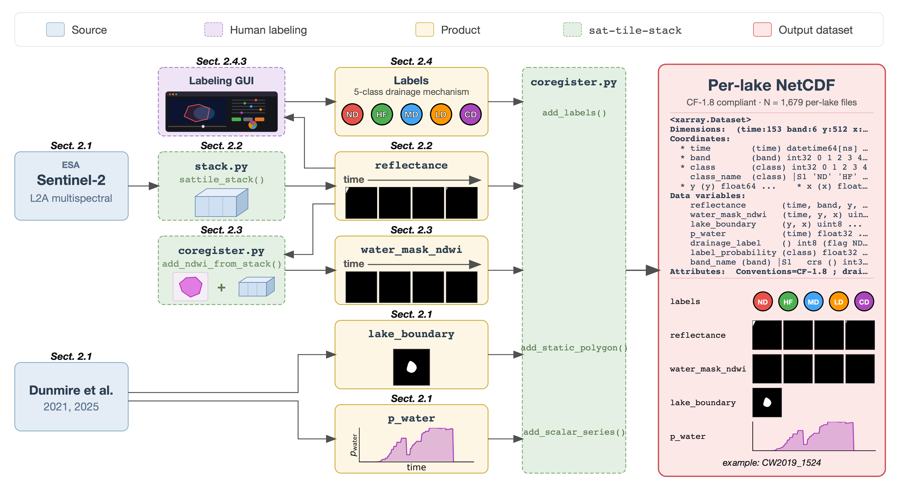

# sat-tile-stack

NOTE: this repo is under active development

`sat-tile-stack` builds deep-learning-ready satellite time-stacks from a STAC
catalog and ships them as **per-area, CF-1.8 NetCDFs**. Built on Microsoft
Planetary Computer and `stackstac`, with optional co-registration of
auxiliary raster/vector/scalar layers onto each stack, an in-browser
labeling GUI, and a CF-1.8 validator. Originally developed for the
supraglacial-lake drainage benchmark accompanying Rines et al. (ESSD, in
review).



## Installation and Dependencies
For now, `sat_tile_stack` can be installed via
```
pip install --upgrade --force-reinstall git+https://github.com/jharlanr/sat-tile-stack.git
```

Optional extras:
- `pip install "sat-tile-stack[labeling]"` — Flask backend for the `lakelabel` GUI
- `pip install "sat-tile-stack[validation]"` — pulls `cfchecker` for the authoritative CF-1.8 validator

## Pipeline

Four per-area, resume-safe stages. Every writer goes through
`io.write_netcdf` (atomic temp-rename + CF finalize), so a crashed run
can't corrupt a good file. Each stage is also idempotent, so a SLURM
array can fan out across many areas and rerun freely.

| Stage | Entry point | What it adds to the per-area `.nc` |
|---|---|---|
| **1. Stack** | `stack.sattile_stack(...)` | `reflectance(time, band, y, x)` + `cloud_mask(time, y, x)` |
| **2. Co-register** | `coregister.add_ndwi_from_stack`, `add_static_polygon`, `add_scalar_series`, `add_raster_zarr` | top-level CF variables (e.g. `water_mask_ndwi`, `lake_boundary`, `p_water`) |
| **3. Label** *(optional)* | `coregister.add_labels` (in-place NetCDF append) — or `lakelabel` (browser GUI for human labeling) | scalar `drainage_label` + `label_probability(class)` soft vector |
| **4. Validate** | `cf_check.cf_check(paths, ...)` — or `sts-cf-check` CLI | dependency-free structural audit + authoritative `cfchecker` when installed |

Per-area SLURM drivers for an end-to-end build (stack → coregister → labels →
cf-check, in one job) live under `engine/{stacking,labeling,validation}/`.

## Example usage

Build a 153-day daily Sentinel-2 RGB+NIR stack around one point:

```python
import pystac_client, planetary_computer
from sat_tile_stack import sattile_stack

catalog = pystac_client.Client.open(
    "https://planetarycomputer.microsoft.com/api/stac/v1",
    modifier=planetary_computer.sign_inplace,
)
da = sattile_stack(
    catalog,
    centroid=(-49.5, 67.5),                # (lon, lat)
    band_names=["B04", "B03", "B02", "B08"],
    collection="sentinel-2-l2a",
    time_range="2019-05-01/2019-09-30",
    cadence="D",
    cloudmask=True,
)
```

See [`docs/LABELING_FOR_COLLABORATORS.md`](docs/LABELING_FOR_COLLABORATORS.md)
for end-to-end labeling instructions with the `lakelabel` GUI.

## Supported Satellite Products

`sat-tile-stack` works with any STAC collection via the `collection` parameter. Below are the most common options available on Microsoft Planetary Computer.

### Choosing a collection

| Collection ID | Satellite | What it measures | Processing Level | Best for |
|--------------|-----------|-----------------|-----------------|----------|
| `sentinel-2-l2a` | Sentinel-2A/B | Multi-spectral optical (13 bands, visible to SWIR) | L2A: surface reflectance (atmospherically corrected) | Land cover, vegetation, water bodies, snow/ice. **Recommended default for most use cases.** |
| `sentinel-2-l1c` | Sentinel-2A/B | Same sensor, same bands | L1C: top-of-atmosphere reflectance (not atmospherically corrected) | Use only if you need raw TOA values or L2A is unavailable for your region/date. |
| `sentinel-1-grd` | Sentinel-1A/B | C-band SAR (radar backscatter) | GRD: ground range detected | All-weather/night imaging, ice monitoring, flood mapping, soil moisture. Cloud-penetrating — no cloud masking needed. |
| `sentinel-1-rtc` | Sentinel-1A/B | Same sensor, radiometrically terrain corrected | RTC: corrected for terrain distortion | Same as GRD but with terrain correction — better for mountainous or sloped terrain. |
| `landsat-c2-l2` | Landsat 8/9 | Multi-spectral optical (7 bands + thermal) | Collection 2 Level 2: surface reflectance | Long time series (Landsat archive back to 1972), thermal analysis, change detection. Lower resolution (30m) but longer revisit history. |

**Key differences between S2 L2A and L1C:**
- **L2A** (recommended): atmospherically corrected surface reflectance. Pixel values represent what's actually on the ground. Includes the SCL (Scene Classification Layer) band for cloud masking.
- **L1C**: top-of-atmosphere reflectance. Includes atmospheric effects (haze, aerosol scattering). No SCL band — you'd need to supply your own cloud mask or use the Williamson method with B11.

**Key differences between S1 GRD and RTC:**
- **GRD**: standard product, faster to process. Fine for flat terrain (ice sheets, oceans, plains).
- **RTC**: terrain-corrected, removes geometric distortion from topography. Better for mountainous areas where GRD would have layover/shadow artifacts.

### Native Resolutions

The `pix_res` parameter controls the output resolution — stackstac will resample to whatever you request. Setting `pix_res` below the native resolution interpolates (no new information); setting it above downsamples.

### Sentinel-2 L2A (`sentinel-2-l2a`)

| Band | Name | Wavelength (nm) | Native Res (m) | Notes |
|------|------|-----------------|----------------|-------|
| B02 | Blue | 490 | 10 | |
| B03 | Green | 560 | 10 | |
| B04 | Red | 665 | 10 | |
| B05 | Veg Red Edge 1 | 705 | 20 | |
| B06 | Veg Red Edge 2 | 740 | 20 | |
| B07 | Veg Red Edge 3 | 783 | 20 | |
| B08 | NIR | 842 | 10 | |
| B8A | NIR Narrow | 865 | 20 | |
| B09 | Water Vapour | 945 | 60 | |
| B11 | SWIR 1 | 1610 | 20 | Used by `williamson` cloud mask |
| B12 | SWIR 2 | 2190 | 20 | |
| SCL | Scene Classification | — | 20 | Used by `scl` cloud mask |

Stored as raw DNs; convert to surface reflectance via
`rho = (DN + boa_add_offset) / 10000` (the `boa_add_offset` per-timestep
coord is 0 for processing baseline ≤ 03.00, nonzero for ≥ 04.00).

### Sentinel-1 GRD IW (`sentinel-1-grd`)

| Band | Polarization | Pixel Spacing (m) | True Resolution (m) | Notes |
|------|-------------|-------------------|---------------------|-------|
| VV | Co-pol vertical | 10 | ~20 × 22 | Backscatter (dB), not reflectance |
| VH | Cross-pol | 10 | ~20 × 22 | |
| HH | Co-pol horizontal | 10 | ~20 × 22 | Depending on acquisition mode |
| HV | Cross-pol | 10 | ~20 × 22 | |

Pixel spacing is 10m but true spatial resolution is ~20m (oversampled). Values are backscatter in dB (typically -25 to 0). No cloud cover metadata — use `query={}` to skip cloud filtering. SAR is cloud-penetrating so cloud masking is not needed.

### Landsat 8/9 Collection 2 (`landsat-c2-l2`)

| Band | Name | Wavelength (nm) | Native Res (m) | Notes |
|------|------|-----------------|----------------|-------|
| SR_B1 | Coastal Aerosol | 443 | 30 | |
| SR_B2 | Blue | 482 | 30 | |
| SR_B3 | Green | 561 | 30 | |
| SR_B4 | Red | 655 | 30 | |
| SR_B5 | NIR | 865 | 30 | |
| SR_B6 | SWIR 1 | 1609 | 30 | |
| SR_B7 | SWIR 2 | 2201 | 30 | |
| ST_B10 | Thermal | 10895 | 100 | |
| QA_PIXEL | Quality | — | 30 | Bit-packed cloud/shadow flags |

Surface reflectance values have scale=0.0000275 and offset=-0.2. Revisit: ~16 days per satellite.

## How to Contribute

This package is being actively developed
[here](https://github.com/jharlanr/sat-tile-stack).

If you would like to add new functionality, we welcome new contributions from
anyone as pull requests on [our Github repo](https://github.com/jharlanr/sat-tile-stack).

No contribution is too small, and we also welcome requests for new features
or bug reports. To contribute to `sat-tile-stack` this way, please 
[open an issue on GitHub](https://github.com/jharlanr/sat-tile-stack/issues).
